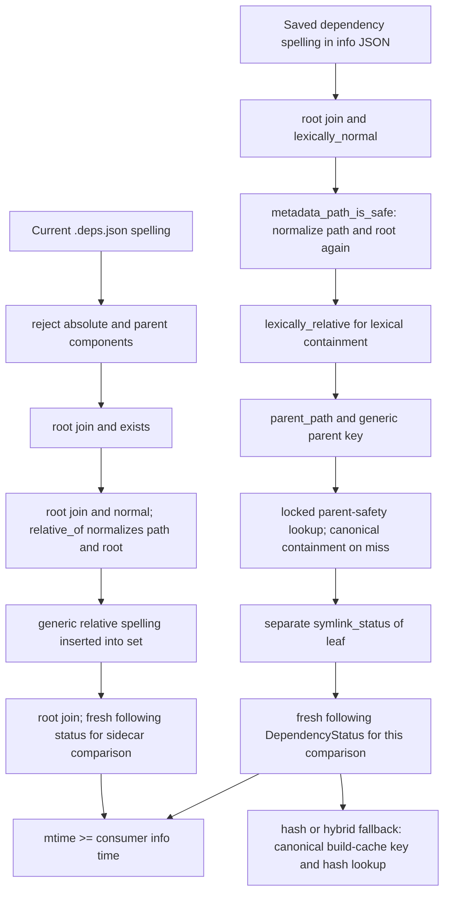

# Static dependency path lifecycle at Experiment 1

Production: 9ce43cac3bddf6e5076d02da5525d424dd22a04f. Static source analysis; operation totals and allocation costs will be established by the fresh profile.

For `obj/u000000`, saved dependencies are config.h, its hook, global.h, module00.h, private000000.h, u000000.cpp, its .deps.json, and its recipe JSON. The current sidecar declares the source, private/module/global headers, and generated config.h. `load_user_dependencies` also inserts the sidecar path itself.

| Role | Concrete spelling | Occurrences in ordinary consumers | Saved check | Current sidecar check |
|---|---|---:|---|---|
| Leaf source | inputs/src/u000000.cpp | one | join+normalize, safety, following status | validation/relative conversion, join, fresh status |
| Private header | inputs/include/private000000.h | one | same | same |
| Module header | inputs/include/module00.h | 1000 | same per consumer | same per consumer |
| Global header | inputs/include/global.h | 10,000 | same per consumer | same per consumer |
| Sidecar | recipes/obj/u000000.deps.json | one | same | derive path from content; JSON reads; relative conversion; fresh status |

`metadata_path_is_safe` has only two production callers, both in `build_reasons`. Both already supply `(root / spelling).lexically_normal()`. The helper computes the same normalized path a second time and recomputes `root.lexically_normal()` for every saved dependency/requirement. An initial bounded candidate can remove just this repeated normalization family: retain a normalized root locally in one consumer check and explicitly pass already-normalized paths to the safety helper. The relative containment check, parent derivation/key, mutex-protected parent containment lookup, separate no-follow leaf query and physical containment on symlink remain intact.

Representations remain distinct: original saved spelling (snapshot authority), normalized project-relative spelling produced by relative_of, normalized absolute path (lexical containment), canonical physical identity (containment/alias authority), symlink leaf identity (no-follow observation), and canonical build-cache key (only where the existing hash/source cache contract requires it). Modified clean comparisons do not call current_hash_cached/build_cache_key; hash/hybrid fallbacks retain their existing behavior.

Allocation counts are not deduced from these source operations. Path allocations are ABI- and inlining-dependent; use Callgrind call arcs on the production binary. Parent-map lookup contention is also not inferred from serialized Callgrind timings.
